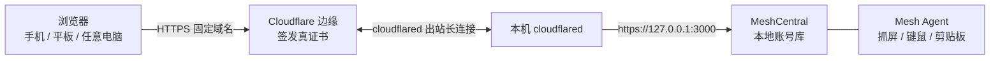

# Windows 远程桌面 · MeshCentral + Cloudflare Tunnel

在 Windows 上搭一套**连接端免安装**的远程桌面：浏览器打开一个固定网址，输一次密码就能操作本机桌面。手机、平板、别人的电脑都能用。

全程只需要 Node.js —— **不需要 WSL，不需要 Docker，也不需要启用 Windows 自带的远程桌面（3389）**。

---

## 目录

- [特点](#特点)
- [工作原理](#工作原理)
- [前置条件](#前置条件)
- [一、部署](#一部署)
- [二、启动](#二启动)
- [三、设置开机自启](#三设置开机自启)
- [文件清单](#文件清单)
- [安全说明](#安全说明)
- [已知限制](#已知限制)
- [排错](#排错)

---

## 特点

| 能力 | 说明 |
| --- | --- |
| 连接端零安装 | 纯浏览器，不装客户端、不装 App、不装插件 |
| 不需要公网 IP | 走 Cloudflare **出站**隧道，家宽没有公网 IP 也能用 |
| 固定地址 + 自动 HTTPS | 证书由 Cloudflare 边缘签发，本机不用折腾自签证书 |
| 不碰 WSL / Docker | 单个 Node 进程，Windows 原生运行 |
| 不开 3389 | 用 MeshCentral 自己的 Agent 抓屏，不用启用系统远程桌面 |
| 无外部账号体系 | 账号只存在本机数据库；无云端登录、无邮件验证、无二次验证 |

内置远程桌面、文件管理、终端、剪贴板、Wake-on-LAN。

---

## 工作原理



隧道是**出站**连接，所以本机不需要开放任何入站端口，也不需要在路由器上做端口映射。

---

## 前置条件

| 项目 | 要求 |
| --- | --- |
| 系统 | Windows 10 / 11 |
| Node.js | 18 / 20 / 22 LTS（本项目在 22.22.2 上实测通过） |
| cloudflared | 任意较新版本（实测 2025.11.1） |
| Cloudflare | 一个免费账号 + 一个已接入 Cloudflare 的域名 |

> 想要**固定地址**就必须有域名。只是临时连一下，可以跳过域名直接用 Quick Tunnel（地址每次变，见下方排错）。

---

## 一、部署

### 1. 安装 cloudflared

```powershell
winget install --id Cloudflare.cloudflared
```

装完确认：

```powershell
cloudflared --version
```

### 2. 安装 Node.js

从 <https://nodejs.org/> 下载 LTS 版 MSI 安装即可。**跟 WSL 没关系**，装的是 Windows 原生版本。

```powershell
node -v
npm -v
```

### 3. 安装 MeshCentral

```powershell
mkdir C:\mesh
cd C:\mesh
npm init -y
npm install meshcentral
```

> **不要用 `npm install -g`。** MeshCentral 官方明确说明：全局安装会让 Windows 服务注册失效（服务会秒退）。必须装在本地目录。

### 4. 首次运行，生成数据目录和自签证书

```powershell
cd C:\mesh
node node_modules\meshcentral
```

看到 `MeshCentral HTTPS server running on ...` 就说明起来了。按 `Ctrl+C` 停掉，这一步只是让它生成 `meshcentral-data\` 目录。

### 5. 写配置

把 [`config/meshcentral-config.example.json`](config/meshcentral-config.example.json) 复制成 `C:\mesh\meshcentral-data\config.json`，按需改：

```jsonc
{
  "settings": {
    "port": 3000,
    // 关键：必须是一个「带点号」的域名形式，否则 MeshCentral 会自动降级成
    // LAN-only 模式（连带丢掉默认 STUN 服务器，P2P 直连更容易失败）。
    // 这里不需要是真的域名，随便一个 FQDN 形式即可。
    "cert": "desk.example.com",

    // 登录走本地账号库
    "auth": "users",

    "_no2FactorAuth": true,          // 关掉二次验证（连接端只输密码）
    "maxInvalidLogin": { "time": 10, "count": 20, "coolofftime": 10 }
  },
  "domains": {
    "": {
      "newAccounts": 0,             // 0 = 关闭自助注册，只有你预建的账号能登录
      "cookieIpCheck": false,       // 必须关：隧道出口 IP 会变，开了会频繁被踢下线
      "sessionIdleTimeout": -1,     // -1 = 不因空闲超时
      "userSessionIdleTimeout": -1
    }
  }
}
```

### 6. 预建一个本地账号

```powershell
cd C:\mesh
node node_modules\meshcentral --createaccount 你的用户名 --pass "换成强密码" --domain ""
node node_modules\meshcentral --adminaccount 你的用户名 --domain ""
```

账号存在本机 `meshcentral-data\meshcentral.db` 里，不上传任何地方。

### 7. 创建 Cloudflare 命名隧道

```powershell
cloudflared tunnel login
```

这一步会打开浏览器让你登录 Cloudflare 并选一个域名授权。**授权链接约 8 分钟超时**，超时后重新执行即可。

```powershell
cloudflared tunnel create desk
cloudflared tunnel route dns desk desk.你的域名.com
```

第一条命令会打印隧道 UUID，并在 `%USERPROFILE%\.cloudflared\` 下生成一个 `<UUID>.json` 凭据文件。第二条命令自动加好 DNS 记录。

### 8. 写隧道配置

把 [`config/cloudflared-config.example.yml`](config/cloudflared-config.example.yml) 复制成 `%USERPROFILE%\.cloudflared\config.yml`，改成自己的隧道 UUID 和域名：

```yaml
tunnel: <你的隧道-UUID>
credentials-file: C:\Users\<你的用户名>\.cloudflared\<你的隧道-UUID>.json

ingress:
  - hostname: desk.你的域名.com
    # 必须写 127.0.0.1 而不是 localhost —— MeshCentral 只监听 IPv4，
    # 而 cloudflared 会把 localhost 解析成 IPv6 ::1，导致连接被拒。
    service: https://127.0.0.1:3000
    originRequest:
      # MeshCentral 用自签证书，必须跳过本机这一段 TLS 校验。
      # 对外那层是 Cloudflare 的真证书，浏览器不会有任何警告。
      noTLSVerify: true
  - service: http_status:404
```

### 9. 验证

先起服务：

```powershell
cd C:\mesh
node node_modules\meshcentral --port 3000
```

另开一个窗口跑隧道：

```powershell
cloudflared tunnel run desk
```

浏览器打开 `https://desk.你的域名.com`，应该能看到 MeshCentral 登录页。

> 登录进去后记得**在设备列表里给本机安装 Mesh Agent** —— 画面是靠它抓的，没装之前是空的设备列表。

---

## 二、启动

配置好之后，日常只需要一个脚本：[`scripts/start-tunnel.bat`](scripts/start-tunnel.bat)

```bat
scripts\start-tunnel.bat
```

它会在前台运行命名隧道（关掉窗口就断开），适合调试。

> **先决条件**：MeshCentral 服务得在跑。如果你已经跑过开机自启脚本，它会自己起来；否则先手动 `net start meshcentral.exe`。

---

## 三、设置开机自启

双击 [`scripts/setup-autostart.bat`](scripts/setup-autostart.bat)。它会**自动请求管理员权限**，UAC 弹窗点「是」，然后等它跑完。

脚本按顺序做这几件事：

| 步骤 | 动作 |
| --- | --- |
| 1 | 释放 3000 端口（停掉手动启动的临时实例） |
| 2 | 把 MeshCentral 注册为 Windows 服务并启动（服务名 `meshcentral.exe`，账户 LocalSystem，开机自启） |
| 3 | 把隧道凭据 `*.json` 和 `cert.pem` 复制到 `%SystemRoot%\System32\config\systemprofile\.cloudflared\` |
| 4 | 在系统级目录生成对应的 `config.yml`（凭据路径改写为系统级绝对路径） |
| 5 | `cloudflared service install`，修正注册表 ImagePath 指向系统级配置，启动服务 |

为什么必须提权、必须复制到那个奇怪的目录：

- 注册 Windows 服务本身需要管理员权限
- **cloudflared 服务以 LocalSystem 账户运行，只读 `systemprofile` 下的配置**，这是官方文档明确的硬要求。放在 `%USERPROFILE%\.cloudflared\` 的那份它读不到（那份是给手动运行用的）

跑完之后两个服务都随开机自动运行，不用再管。

### 卸载自启

```bat
scripts\uninstall-autostart.bat
```

---

## 文件清单

| 文件 | 用途 |
| --- | --- |
| `scripts/install-meshcentral.bat` | 一键完成「部署」章节的 3~6 步 |
| `scripts/start-tunnel.bat` | 手动前台启动隧道（调试用） |
| `scripts/setup-autostart.bat` | **固化开机自启**（自提权） |
| `scripts/uninstall-autostart.bat` | 撤销开机自启 |
| `config/meshcentral-config.example.json` | MeshCentral 配置模板 |
| `config/cloudflared-config.example.yml` | 隧道配置模板 |
| `docs/troubleshooting.md` | 踩过的坑与解法 |

安装后的实际位置（不在仓库里）：

| 位置 | 内容 |
| --- | --- |
| `C:\mesh\` | MeshCentral 程序本体、`meshcentral-data\`（配置 + 账号数据库） |
| `%USERPROFILE%\.cloudflared\` | 隧道凭据 `<UUID>.json`、`cert.pem`、手动运行用的 `config.yml` |
| `%SystemRoot%\System32\config\systemprofile\.cloudflared\` | 服务运行用的 `config.yml` 和凭据副本 |

---

## 安全说明

这套设计的默认姿势是「**本机需要账号，连接端只输密码**」，所以有几处是刻意放宽的，你应当知道：

- `newAccounts: 0` —— 自助注册已关闭。别人就算拿到你的网址，也**注册不了**账号，只能用你预建的那个。
- `_no2FactorAuth: true` —— 二次验证关闭。**这是为了满足「连接端只输密码」这个需求而牺牲的**。如果你的场景更看重安全，建议改回开启，或加上 Cloudflare Access 做一层 SSO。
- `cookieIpCheck: false` —— 必须关。隧道出口 IP 会变化，开启会导致频繁掉线。

建议的加固手段：

1. **换端口**：把 `port` 从 `3000` 改成别的。
2. **加 Cloudflare Access**：在 Cloudflare Zero Trust 里给这个域名加一条 Access 应用，要求邮箱验证码或 SSO。这是最有效的一层，且不动本机配置。
3. **别用常见用户名**：`admin` / `home` / `test` 这类名字是暴力破解的首选目标。配置里有 `maxInvalidLogin` 速率限制兜底，但仍建议换个名字。
4. **定期轮换密码**：`node node_modules\meshcentral --resetaccount 用户名 --pass "新密码" --domain ""` 可以重置密码并同时解除锁定、关闭 2FA。

### 绝对不要提交到仓库的东西

仓库的 `.gitignore` 已经排除了这些，**请务必不要再手动加回来**：

- `*.db` —— 账号数据库
- `cert.pem`、`<UUID>.json` —— 隧道凭据
- `config.yml` / `config.json` —— 含你的真实域名和密码策略
- 任何记录账号密码的文本文件

---

## 已知限制

| 限制 | 说明 |
| --- | --- |
| **中文输入是弱项** | 浏览器里的 RDP 类客户端没法跑远端输入法，中文常打不出来。**最稳的办法是走剪贴板粘贴**。这也是这套方案最大的短板 |
| 不适合看视频 | 抓屏是逐帧压缩传输，远端放视频会像幻灯片。办公、改代码、看网页没问题 |
| 浏览器选择 | 用 **Chrome / Edge**。Firefox 缺剪贴板直连、部分组合键失效、缩放会糊 |
| 带宽瓶颈在上行 | 真正的瓶颈通常是你家宽的上行带宽（常见 30~50 Mbps），不是隧道本身 |

---

## 排错

完整版见 [`docs/troubleshooting.md`](docs/troubleshooting.md)。几个最常踩的：

**页面 502**

先看本机服务起没起：浏览器打开 `https://127.0.0.1:3000`。打不开就 `net start meshcentral.exe`。

**cloudflared 报 `connection refused` / `dial tcp [::1]:3000`**

配置里 `service` 写成了 `localhost`。改成 `127.0.0.1`。

**cloudflared 报 `x509: certificate signed by unknown authority`**

`originRequest.noTLSVerify` 没生效，检查缩进是否正确写在了 hostname 那一项的下面。

**cloudflared 命令报 `context deadline exceeded`**

本机有代理在拦 API 调用。临时去掉代理环境变量再跑：

```bash
env -u http_proxy -u https_proxy -u HTTP_PROXY -u HTTPS_PROXY cloudflared tunnel create desk
```

**MeshCentral 端口自己跳到 3001**

3000 被占时它会静默顺延到下一个可用端口。用 `netstat -ano | findstr :3000` 找出占用进程清掉，然后重启服务。

**想临时用一下，不想配域名**

用 Quick Tunnel：

```powershell
cloudflared tunnel --url https://127.0.0.1:3000 --no-tls-verify
```

好处是**完全不用 Cloudflare 账号**。代价：地址每次启动都变、进程关了就断、约 5 分钟无连接自动回收、不支持非 HTTP 服务。

---

## 许可证

[MIT](LICENSE)

MeshCentral 本身是 Apache 2.0 许可，Cloudflare 的 `cloudflared` 是 Apache 2.0 许可。本仓库只包含部署脚本和配置模板。
